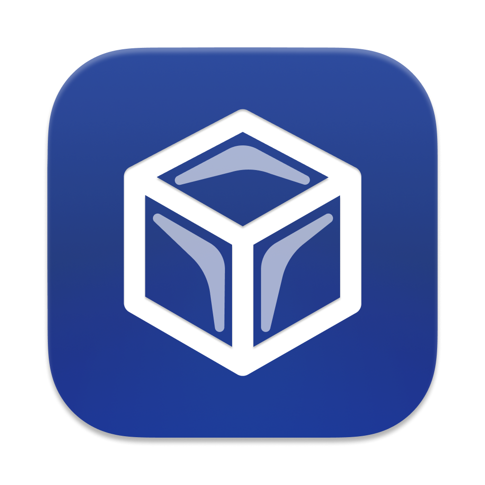

<div align="center">
    
    <h1>Ice</h1>
</div>

Ice is a powerful menu bar management tool. While its primary function is hiding and showing menu bar items, it aims to cover a wide variety of additional features to make it one of the most versatile menu bar tools available.


[](https://github.com/Sh7ne/Ice/releases/latest)


[](LICENSE)
[](https://www.buymeacoffee.com/sh7ne)

> [!IMPORTANT]
> This repository is a modified fork of
> [jordanbaird/Ice](https://github.com/jordanbaird/Ice), maintained by
> [Sh7ne](https://github.com/Sh7ne). Fork-specific changes began in August 2026
> and remain licensed under GPL-3.0.

> [!NOTE]
> Ice is currently in active development. Some features have not yet been implemented. Download the latest release [here](https://github.com/Sh7ne/Ice/releases/latest) and see the roadmap below for upcoming features.

## Install

### Manual Installation

Download `Ice.zip` from the
[latest release](https://github.com/Sh7ne/Ice/releases/latest), open the archive,
and move `Ice.app` into your `Applications` folder.

### Local Developer-signed build

To create an Apple silicon release for the current Mac, install a valid Apple
Development or Developer ID Application certificate and run:

```sh
./Scripts/build-local-release.sh
```

The script selects an Apple Development identity by default, signs Ice and all
embedded services with the same team, and keeps the hardened runtime enabled.
It also removes Intel slices from Sparkle's updater components so the installed
app does not depend on Rosetta. Set `ICE_CODE_SIGN_IDENTITY` to choose a
different installed signing identity. When that identity belongs to another
team, set its Team ID with `ICE_DEVELOPMENT_TEAM` as well.

On macOS 26 or later, run the isolated Release app-to-XPC round-trip check
without requesting Accessibility or Screen Recording permissions:

```sh
./Scripts/smoke-test-xpc.sh
```

Version tags can build and publish notarized Apple silicon releases through
GitHub Actions. See [Releasing Ice](docs/RELEASING.md) for the required Apple
credentials and tag format.

## Features/Roadmap

### Menu bar item management

- [x] Hide menu bar items
- [x] "Always-hidden" menu bar section
- [x] Show hidden menu bar items when hovering over the menu bar
- [x] Show hidden menu bar items when an empty area in the menu bar is clicked
- [x] Show hidden menu bar items by scrolling or swiping in the menu bar
- [x] Automatically rehide menu bar items
- [x] Hide application menus when they overlap with shown menu bar items
- [x] Drag and drop interface to arrange individual menu bar items
- [x] Display hidden menu bar items in a separate bar (e.g. for MacBooks with the notch)
- [x] Search menu bar items
- [x] Menu bar item spacing (BETA)
- [ ] Profiles for menu bar layout
- [ ] Individual spacer items
- [ ] Menu bar item groups
- [ ] Show menu bar items when trigger conditions are met

### Menu bar appearance

- [x] Menu bar tint (solid and gradient)
- [x] Menu bar shadow
- [x] Menu bar border
- [x] Custom menu bar shapes (rounded and/or split)
- [ ] Remove background behind menu bar
- [ ] Rounded screen corners
- [ ] Different settings for light/dark mode

### Hotkeys

- [x] Toggle individual menu bar sections
- [x] Show the search panel
- [x] Enable/disable the Ice Bar
- [x] Show/hide section divider icons
- [x] Toggle application menus
- [ ] Enable/disable auto rehide
- [ ] Temporarily show individual menu bar items

### Other

- [x] Launch at login
- [ ] Automatic updates
- [ ] Menu bar widgets

## Why does Ice only support macOS 14 and later?

Ice uses a number of system APIs that are available starting in macOS 14. As such, there are no plans to support earlier versions of macOS.

## Gallery

#### Show hidden menu bar items below the menu bar


#### Drag-and-drop interface to arrange menu bar items


#### Customize the menu bar's appearance


#### Menu bar item search


#### Custom menu bar item spacing


## License

Ice and this modified fork are available under the [GPL-3.0 license](LICENSE).
The upstream copyright and license notices remain intact; modification history
and dates are recorded in Git.
